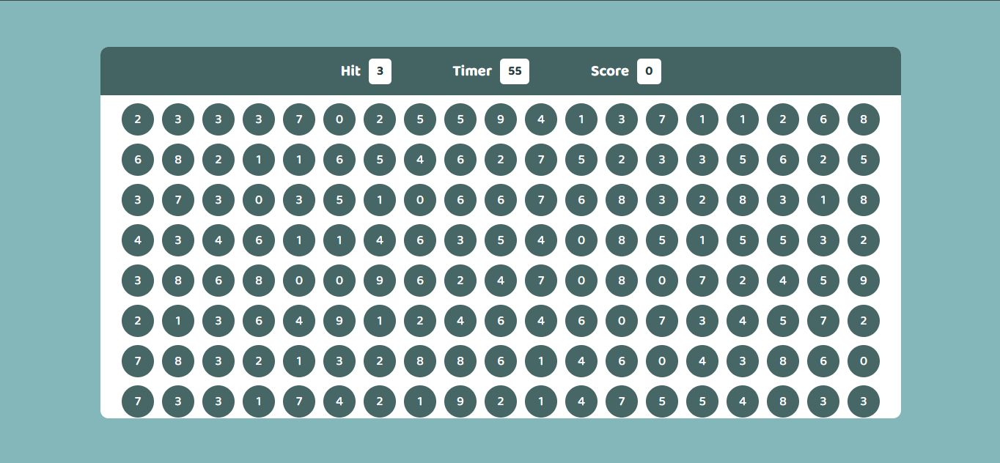

# 🎯 Bubble Game

A fun and simple browser-based bubble clicking game built using **HTML**, **CSS**, and **JavaScript**. Players must click the correct number bubble before time runs out to score points.

## 🕹️ How to Play

- You are given a target number to "hit" (shown in the "Hit" box).
- Click on bubbles that match the target number.
- Each correct hit gives you **+10 points** and refreshes the bubbles.
- The game runs for **60 seconds**.
- At the end, your final score is displayed.

## 📸 Screenshot



## 🧩 Features

- Dynamic bubble generation
- Real-time timer countdown
- Score tracking and display
- Game Over screen with final score

## 🛠️ Tech Stack

- **HTML** – Page structure
- **CSS** – Styling and layout
- **JavaScript** – Game logic and interactivity

## 📁 Project Structure

Project 04 (Bubble game)/
│
├── index.html 
├── style.css 
├── script.js 
└── screenshot.png 


## 🚀 Getting Started

1. Clone this repository:
   ```bash
   git clone https://github.com/Harsharma7958/Bubble-Game.git
2. Navigate to the project directory:
   ```bash
    cd "Project 04(Bubble game)"
3. open index.html in your browser to start playing!

📌 Tips
The faster you click the correct bubble, the higher your score!

Refresh the page to restart the game.
